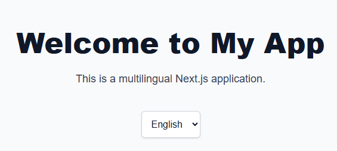

# Next.js Simple Multilingual Frontend Boilerplate



A lightweight, ready-to-use multilingual frontend starter built with **Next.js 15**, **Tailwind CSS**, **TypeScript**, and **next-intl**. Designed for static, client-side rendered applications that support multiple languages.

---

## 🚀 Features

- 🌍 Internationalization (i18n) with `next-intl`
- 🎨 Modern UI with `Tailwind CSS` and `@tailwindcss/typography`
- ⚛️ Latest React 19 and Next.js 15
- 🧼 Code quality with ESLint, Prettier, and TypeScript
- 🔐 Git hooks with Husky + lint-staged
- 💡 Minimal and extensible boilerplate

---

## 🛠️ Installation

```bash
git clone https://github.com/your-username/nextjs-simple-multilingual-frontend-boilerplate.git
cd nextjs-simple-multilingual-frontend-boilerplate
npm install
npm run dev
🔗 Open http://localhost:3000 in your browser.


🧹 Code Quality & Git Hooks
# Run linter
npm run lint

# Setup Husky pre-commit hook
npm run prepare


📁 Project Structure
src/
├── app/
│   └── [lang]/                    # Dynamic route for language support
│       ├── layout.tsx            # Layout wrapper for each language (e.g., <html lang="...">)
│       └── page.tsx              # Main page per language
│
├── components/
│   ├── home-page/
│   │   └── HomePage.tsx          # Homepage content
│   └──layout/
│      └── LanguageSwitcher.tsx  # Language switcher component
│
├── lib/
│   └── i18/
│       └── index.ts              # i18n helper utilities
│
├── locales/                      # Static translation files
│   ├── en.json
│   └── tr.json
│
├── styles/
│   └── global.css                # Global CSS (Tailwind)
│
├── types/
│   └── i18n.ts                   # Type definitions for i18n, etc.
│
├── middleware.ts                 # Middleware for language detection/redirection


📜 License
MIT © Olcay Eryiğit
```
